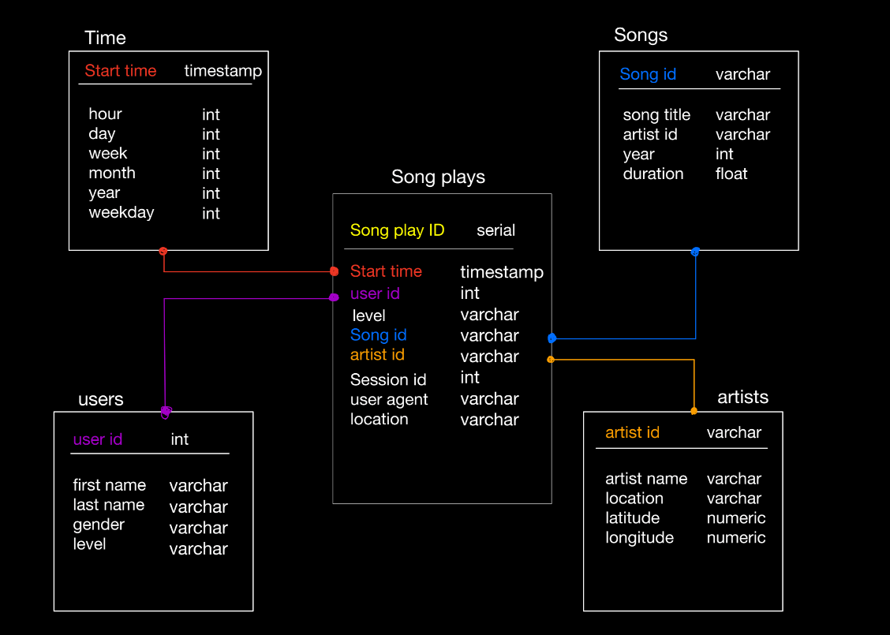

### Project Data Modeling with Postgres

### Project Summary
The objective of this project is to create a SQL analytics database for a fictional music streaming service called Sparkify. Sparkify's analytics team seeks to understand what, when and how users are playing songs on the company's music app. The analysts need an easy way to query and analyze the songplay data, which is currently stored in raw JSON logs and metadata files on a local directory.

As the data engineer assigned to the project, I have implemented an ETL pipeline in python to process and upload the data into a PostgreSQL database. The ETL process extracts each songplay from the list of page actions recorded by the app. Data for analysis, such as song name, user information, subscription tier, and location of user, is structured into the main songplay table and related dimensional tables.

### Introduction

A startup called Sparkify wants to analyze the data they've been collecting on songs and user activity on their new music streaming app. The analytics team is particularly interested in understanding what songs users are listening to. Currently, they don't have an easy way to query their data, which resides in a directory of JSON logs on user activity on the app, as well as a directory with JSON metadata on the songs in their app.

They'd like a data engineer to create a Postgres database with tables designed to optimize queries on song play analysis, and bring you on the project. Your role is to create a database schema and ETL pipeline for this analysis. You'll be able to test your database and ETL pipeline by running queries given to you by the analytics team from Sparkify and compare your results with their expected results.

### Datasets available

The song dataset is a subset of real data from the [Million Song Dataset](https://labrosa.ee.columbia.edu/millionsong/). Each file is in JSON format and contains metadata about a song and the artist of that song. The files are partitioned by the first three letters of each song's track ID.

The log dataset consists of log files in JSON format generated by [this event simulator](https://github.com/Interana/eventsim) based on the songs in the dataset above. These simulate activity logs from a music streaming app based on specified configurations.

### Schema Design

* The fact table `songplays` stores the records in log data associated with song plays i.e. records with page.
* The dimension table `users` stores the users in the app.
* The dimension table `song` stores the songs in the music database.
* The dimension table `artists` stores the artists the in music database.
* The dimension table `time` stores the timestamps of records in songplays broken down into specific units.

### File Guide
There are 7 files in this project. 
1. data - This folder contains the log and song datasets.
2. etl.ipynb - This is a jupyter notebook which I used to create the skeleton for the pipeline. It is kind of a workbook.
3. test.ipynb - This jupyter notebook checks whether the written scripts for creating tables and inserting data are working fine or not.
4. create_tables.py - This program contains postgresql queries for creating the database and tables.
5. etl.py - This script contains the complete ETL pipeline for the project.
6. Readme.md - Documentation regarding the project.
7. sql_queries.py - This python script contains the create and insert contains for the database.

### How to run the project ?
1. To run the project, make sure you have all the above files at a single place.
2. Go to terminal and first run create_tables.py script by typing "python create_tables.py" in the terminal. This will make sure that all the previous databases are dropped and new database with tables are created.
3. Go ahead and run etl.py script by typing "python etl.py". This will run the etl pipeline and extract data from the log files and insert them into the facts and dimension table.s

